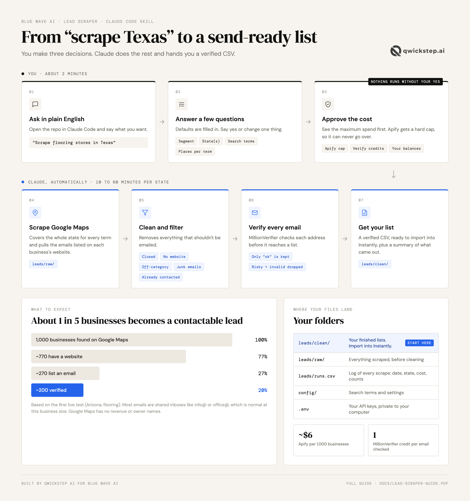

# Blue Wave AI lead scraper

Google Maps → verified email list, one US state at a time, run by talking to Claude Code.



## The documents

Everything you need is in the [`docs/`](docs/) folder. Both open straight in the browser.

| Document | What it covers | Read it when |
|---|---|---|
| 📄 [**Lead Scraper Guide**](docs/Lead-Scraper-Guide.pdf) (3 pages) | Setup, how to run a scrape, where the files land, what to expect | Setting up, or running your first scrape |
| 📄 [**Mailbox & Campaign Cheat Sheet**](docs/Mailbox-and-Campaign-Cheat-Sheet.pdf) (1 page) | Warmup, the mailbox tags, campaign settings, the sequence | Setting up or launching a campaign in Instantly |

The picture above is the scraper in one view. It's also at [docs/how-it-works.png](docs/how-it-works.png).

## One-time setup (about 10 minutes, no terminal)

**1. Install Claude Code in VS Code.** Open VS Code → Extensions icon in the left sidebar → search **Claude Code** → Install → sign in with your Claude account.

**2. Make an empty folder and open it.** File → Open Folder → create a folder called `Lead Scraper` (Documents is fine) → Open. Click the Claude icon to open a chat.

**3. Paste this prompt into the chat:**

```
Set up the Blue Wave AI lead scraper in this folder. Clone https://github.com/jun-qwickstep/bluewave-lead-scraper directly into the current folder, create my .env file from .env.example, and open .env so I can paste my keys. If git or Python 3 is missing, or GitHub asks me to sign in, walk me through it step by step. When you're done, tell me exactly where to paste each key.
```

**4. Paste your two keys** into the `.env` file Claude opened, right after the `=` signs, and save (Cmd+S):

| Line in `.env` | Where to copy it from |
|---|---|
| `APIFY_TOKEN=` | [console.apify.com](https://console.apify.com) → switch to the BlueWaveAI account → Settings → API & Integrations |
| `MILLION_VERIFIER_API_KEY=` | [app.millionverifier.com](https://app.millionverifier.com) → API in the left menu |

`.env` stays on your computer and is never uploaded to GitHub.

**5. Start a new Claude chat** (the **+** button) and say **"check my setup"**. Claude confirms both keys work and which Apify account they belong to. You're ready.

## Running a scrape

Just ask, for example:

> Scrape flooring stores in Arizona

Claude will:

1. **Ask a few questions**: segment, state(s), search terms, how many places per term. It fills in defaults so you can just say yes.
2. **Show the cost** before anything is spent: the Apify maximum (a hard cap, it can't go over), the MillionVerifier credits needed, and your current balances.
3. **Wait for your yes.**
4. **Scrape** the whole state on Google Maps, including the emails listed on each business's website.
5. **Clean**: removes closed businesses, no-website listings, off-category results (carpet cleaners, furniture stores…), junk emails, and anything already in an earlier batch.
6. **Verify** every email with MillionVerifier.
7. **Save the files** and tell you what came out.

## Where everything is

You only ever need one folder: **`leads/clean/`**.

| Folder / file | What's in it |
|---|---|
| **`leads/clean/`** | **Your finished lists. Start here.** One CSV per scrape, verified emails only. Import these into Instantly. |
| `leads/raw/` | Everything Google Maps returned, before cleaning. Only for reference. |
| `leads/runs.csv` | A log of every scrape: date, state, search terms, cost and lead counts. |
| `config/` | Search terms and settings. Ask Claude to change them for you. |
| `.env` | Your two API keys. Stays on your computer, never uploaded. |
| `docs/` | The two guides and the diagram. |
| `.claude/` | The skill itself. No need to touch it. |

Each scrape is named `date_STATE_segment`. So `leads/clean/2026-09-24_TX_flooring_clean-712.csv` is the Texas flooring list from Sept 24, with 712 verified emails. A second run of the same state on the same day gets `-2`.

**Don't delete files in `leads/clean/`.** They're how the scraper knows who has already been contacted, so no business ever lands in two lists.

## What to expect

- **Cost** is about $0.006 per business on Apify's free plan (less on paid plans) plus 1 MillionVerifier credit per email. A mid-size state is typically $5–15 on Apify. Every run has a hard spend cap, which Apify won't set below $0.50.
- **Apify's free plan** includes $5 of usage a month, which is enough for a test but not a full state. A real state needs a paid plan or a higher usage limit.
- **Emails** come from each business's own website. Around half of businesses list one, and most are shared inboxes (info@, office@). Those are fine and kept in the same list, tagged `email_type = generic`.
- **No revenue or headcount filter.** Google Maps doesn't have that data. Use `review_count` and the `likely_chain` / `known_chain` columns to sort.
- **No owner names.** Google Maps doesn't list them.

## Changing what gets scraped

- Search terms and category keywords: `config/segments.json`
- Emails per business, the chain list, removing chains outright, prices: `config/settings.json`

Or just ask Claude to change them.
